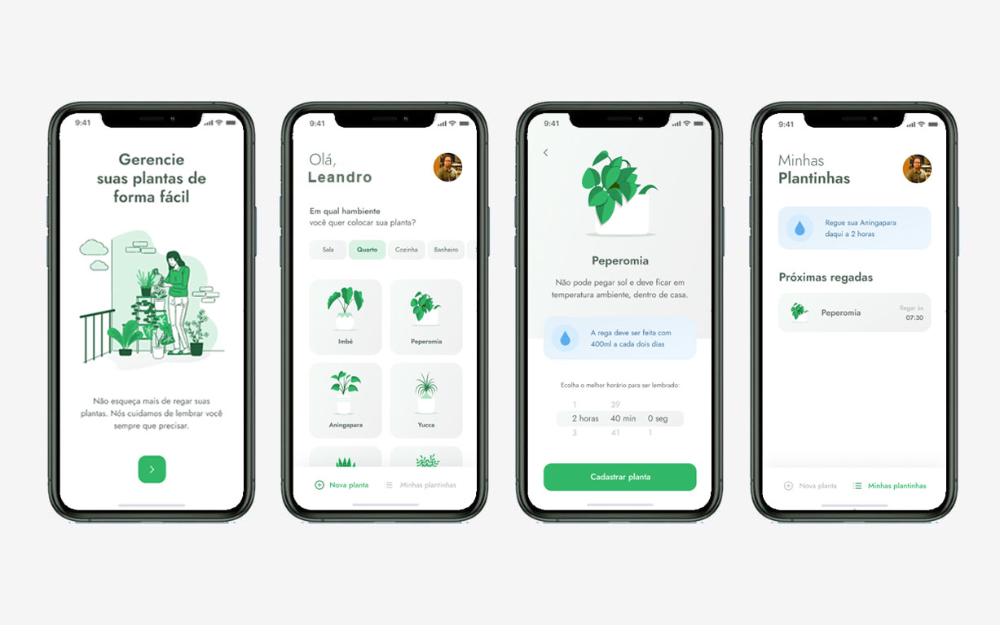

# Plant Manager

  

Aplicativo que te ajudar a lembrar de cuidar de suas plantas de forma fácil de acordo com cada tipo de plantinha.

### Técnologias utilizadas:

* React Native 
* Typescript
* Expo

### Layout:

Você pode visualizar o layout do projeto através <a href="https://www.figma.com/file/JnsOZl1bfCKrQRmQuPszdN/PlantManager-(Copy)">desse link</a>. É necessário ter conta no Figma para acessá-lo.